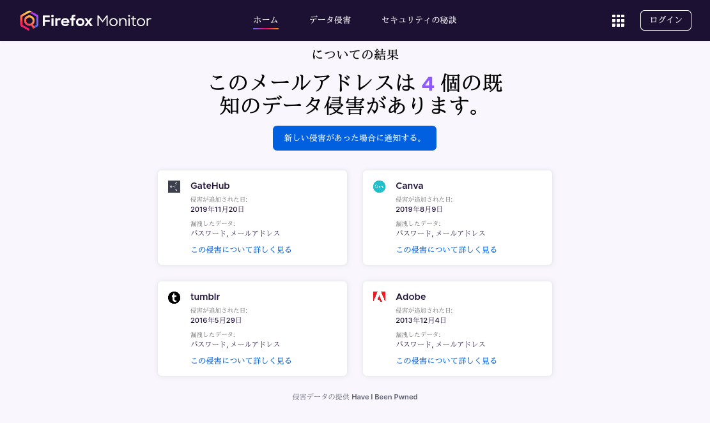
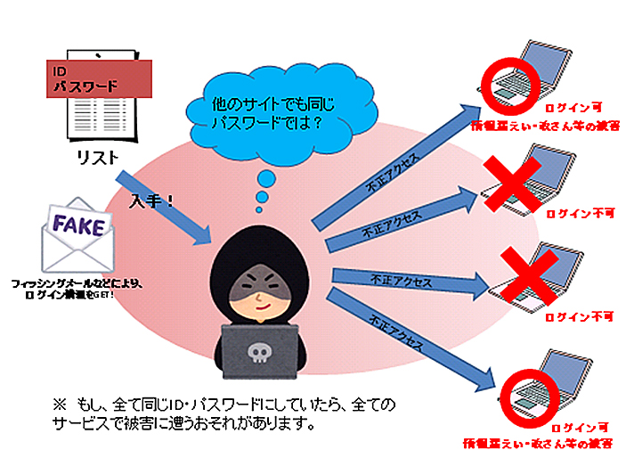

# 目次
* [はじめに](#はじめに)
* [そもそも Firefox Monitorとは？](#そもそも-firefox-monitorとは)
* [使ってみた結果どうだったのか？](#使ってみた結果どうだったのか)
* [その後どうしたか？](#その後どうしたか)
* [一件落着・・だが・・](#一件落着だが)
* [問題点の列挙](#問題点の列挙)
  * [Firefox Monitor で検知できるサービスには抜けがある](#firefox-monitor-で検知できるサービスには抜けがある)
  * [変更したパスワードが使い回しになっていては一件落着になっていない](#変更したパスワードが使い回しになっていては一件落着になっていない)
  * [第三者が他者のメールアドレスからデータ侵害状況を把握できてしまう](#第三者が他者のメールアドレスからデータ侵害状況を把握できてしまう)
* [問題点に対する対処法](#問題点に対する対処法)
  * [アカウント登録をしている全サービスのパスワードを最大文字種類・最大桁数で全て異なるものに設定する](#アカウント登録をしている全サービスのパスワードを最大文字種類最大桁数で全て異なるものに設定する)
  * [二段階認証(2FA)に対応しているサービスは 二段階認証(2FA)を設定する](#二段階認証2faに対応しているサービスは-二段階認証2faを設定する)
  * [(余裕があれば) アカウント登録をしているサービスのID(メールアドレス)を散らして設定する](#余裕があれば-アカウント登録をしているサービスのidメールアドレスを散らして設定する)
* [余談(二段階認証(2FA)について)](#余談二段階認証2faについて) 
* [おわりに](#おわりに)

# はじめに
[Firefox Monitor](https://monitor.firefox.com/) をご存知だろうか？  
[Firefox Monitor](https://monitor.firefox.com/) の利用を通して、個人のパスワード管理について個人的な見解を述べたい。

# そもそも Firefox Monitorとは？
[Firefox Monitor](https://monitor.firefox.com/) とは、`自分のメールアドレスでアカウント登録をしている各種サービス`から、データ(`メールアドレス`, `パスワード`, `電話番号`...)の侵害状況を把握できるWebサービスです。  
[Firefoxアカウント](https://www.mozilla.org/ja/firefox/accounts/) のメインメールアドレスを登録すれば、新たにデータ侵害が発覚した際に 通知を受け取る事もできます。

# 使ってみた結果どうだったのか？
ははは・・・  

# その後どうしたか？
データ侵害を受けていたサービスのパスワードだけ 覚えられる範囲のものに変更しました。  
(メールアドレスを変えるのは大掛かり過ぎる・・)  
※[問題点の列挙](#問題点の列挙)から話を展開したいため ここの対応はあえて穴(問題点)があるように創作しています。

# 一件落着・・だが・・
これで一件落着です。  
・・・と、果たしてそうでしょうか？  
ここからは、もう一歩踏み込んだ話をしていきます。

# 問題点の列挙
ここまでの話にはいくつかの穴(問題点)があります。
* [Firefox Monitor で検知できるサービスには抜けがある](#firefox-monitor-で検知できるサービスには抜けがある)
* [変更したパスワードが使い回しになっていては一件落着になっていない](#変更したパスワードが使い回しになっていては一件落着になっていない)
* [第三者が他者のメールアドレスからデータ侵害状況を把握できてしまう](#第三者が他者のメールアドレスからデータ侵害状況を把握できてしまう)

それぞれの内容を見ていきます。

## Firefox Monitor で検知できるサービスには抜けがある
[Firefox Monitor](https://monitor.firefox.com/) がどのようにしてデータ侵害状況を検知しているのか知りませんが、網羅的にサービスを検知できているとは思えません。  
`抜けがある`と証明することはできませんが、`抜けがない`とも証明できません。  
このような場合、悪い方(`抜けがある`)で 考えるのが適切です。

・・・と、調査から逃げようとしましたが、もうちょっと根拠を補強します。  
まず、[Firefox Monitor](https://monitor.firefox.com/) の実態(侵害データの提供元)は [Have I Been Pwned](https://haveibeenpwned.com/) です。  
[Have I Been Pwned](https://haveibeenpwned.com/)で侵害データとして報告されているサービスは[Pwned websites](https://haveibeenpwned.com/PwnedWebsites)に掲載されています。  
どのように[Pwned websites](https://haveibeenpwned.com/PwnedWebsites)を裏付けているかは、主にペーストサイト([Pastebin](https://pastebin.com/)...)からの流出の監視のようです。([Pastes](https://haveibeenpwned.com/Pastes)より)  
ですので、特定の集団内のプライベートなネットワークで侵害データが共有されているような場合は 当然に[Have I Been Pwned](https://haveibeenpwned.com/)側からは検知ができません。  

つまり、[Firefox Monitor で検知できるサービスには抜けがある](#firefox-monitor-で検知できるサービスには抜けがある) ということです。  
[その後どうしたか？](#その後どうしたか)では、検知できた各種サービスに対してのみパスワード変更をしていますが、それだけでは不十分だと言えます。

## 変更したパスワードが使い回しになっていては一件落着になっていない
これを表現するのに、丁度良い画像が見つかりました。  
  
出典: 大阪府警察「STOP!パスワード使い回し」 - https://www.police.pref.osaka.lg.jp/seikatsu/saiba/cyber_cyuikanki/9573.html  

現代(2021年代)のログイン方式は`ID(メールアドレス) + パスワード`の組み合わせが一般的です。  
メールアドレスを複数所有し それを各種サービスで使い分ける事は労力的に困難であることから、第三者は`メールアドレスは各種サービスで使い回されている`と容易に推測します。  
つまり、`1箇所のサービスからID(メールアドレス)が漏洩した` = `全てサービスからID(メールアドレス)が漏洩した` という等式が成り立ちます。  

上記を踏まえ、更にパスワードを使い回していたとします。  
するとどうでしょうか、これもID(メールアドレス)の話で登場した等式が成り立ちます。  
`1箇所のサービスからパスワードが漏洩した` = `全てサービスからパスワードが漏洩した` 。  

まとめると、改めて 最悪な状況(事実)と認識いただけるのではないかと思います。
* `全てサービスからID(メールアドレス)が漏洩した`
* `全てサービスからパスワードが漏洩した` 

[変更したパスワードが使い回しになっていては一件落着になっていない](#変更したパスワードが使い回しになっていては一件落着になっていない) ということです。  
[その後どうしたか？](#その後どうしたか)では、面倒だからと他サービスで使用されているパスワードに変更をしていますが、それだけでは不十分だと言えます。

## 第三者が他者のメールアドレスからデータ侵害状況を把握できてしまう
[Firefox Monitor](https://monitor.firefox.com/) のトップページからお分かりいただけると思いますが、他者のメールアドレスでも検索ができてしまいます。  
つまり、[第三者が他者のメールアドレスからデータ侵害状況を把握できてしまう](#第三者が他者のメールアドレスからデータ侵害状況を把握できてしまう)のですね・・  

第三者が他者のメールアドレスを知り得たとして、その第三者がそのメールアドレスを検索すると 以下のデータが第三者に渡ります。
* 他者のデータ侵害状況
* 他者の利用サービス(データ侵害状況に限定される)

これだけの情報が渡っただけではパッとしませんが、前述した
* [Firefox Monitor で検知できるサービスには抜けがある](#firefox-monitor-で検知できるサービスには抜けがある)
* [変更したパスワードが使い回しになっていては一件落着になっていない](#変更したパスワードが使い回しになっていては一件落着になっていない)

を組み合わせて考えると、以下のような不正ログインのフローが想定されます。
1. 第三者がターゲットのメールアドレスを知る
2. 第三者が[Firefox Monitor](https://monitor.firefox.com/) からターゲットのデータ侵害状況を把握する
3. ターゲットのデータ侵害状況をヒントに データ(`ID(メールアドレス) + パスワード`)を調査・取得
4. ターゲットのデータ侵害状況やターゲットの特性などをヒントに `手順3`で得たデータで各利用サービスへ不正ログイン

`手順3`は データがネット上にバラまかれるような事態でない限り成立しませんが、悪い方(成立する)と想定した方が良いのでしょう。

# 問題点に対する対処法
ここまで 問題点を深堀りしました。  
問題の把握が進んだ次は 自己防衛をしていかねばなりません。  
考え出したらキリがありませんが、労力と相談した時の現実的な自己防衛策としては以下が考えられます。
* [アカウント登録をしている全サービスのパスワードを最大文字種類・最大桁数で全て異なるものに設定する](#アカウント登録をしている全サービスのパスワードを最大文字種類最大桁数で全て異なるものに設定する)
* [二段階認証(2FA)に対応しているサービスは 二段階認証(2FA)を設定する](#二段階認証2faに対応しているサービスは-二段階認証2faを設定する)
* [(余裕があれば) アカウント登録をしているサービスのID(メールアドレス)を散らして設定する](#余裕があれば-アカウント登録をしているサービスのidメールアドレスを散らして設定する)

## アカウント登録をしている全サービスのパスワードを最大文字種類・最大桁数で全て異なるものに設定する
> 最大文字種類・最大桁数

[問題点の列挙](#問題点の列挙)で色々と述べましたが、それ以前に ログイン情報を推測によって破られてしまっては意味がありません。  
また、推測しなくとも 機械的な`ブルートフォースアタック(総当り攻撃)`で破られてしまっても意味がありません。  
各サービス毎に設定可能な`最大文字種類・最大桁数`に従って設定しておく必要があります。  

> 全サービス

[Firefox Monitor で検知できるサービスには抜けがある](#firefox-monitor-で検知できるサービスには抜けがある) で述べた通り、  
厳密なデータ侵害状況が把握できない以上、現状のデータ侵害状況をリセットする意味で 全サービスを対象とするのが適切です。

> 全サービス  
> 全て異なるもの

[変更したパスワードが使い回しになっていては一件落着になっていない](#変更したパスワードが使い回しになっていては一件落着になっていない) で述べた通り、  
仮に1箇所のサービスから漏れても 他サービスに被害が拡大しないよう あらかじめ全サービスに対し 全て異なるパスワードを設定しておく必要があります。  
(端的に言えば`パスワードリスト攻撃から身を守ろう`です。)

## 二段階認証(2FA)に対応しているサービスは 二段階認証(2FA)を設定する
[アカウント登録をしている全サービスのパスワードを最大文字種類・最大桁数で全て異なるものに設定する](#アカウント登録をしている全サービスのパスワードを最大文字種類最大桁数で全て異なるものに設定する) を完全に対応していても サービス運営元からデータが漏洩してしまっては 破られたも同然です。  
二段階認証(2FA)は、現在設定しているデータ(`ID(メールアドレス) + パスワード`)が漏洩した場合の保険になります。  
対応している全サービスに対して、時間経過によってパスワードが変化する形式の 二段階認証(2FA)をあらかじめ設定しておく必要があります。  

## (余裕があれば) アカウント登録をしているサービスのID(メールアドレス)を散らして設定する
[アカウント登録をしている全サービスのパスワードを最大文字種類・最大桁数で全て異なるものに設定する](#アカウント登録をしている全サービスのパスワードを最大文字種類最大桁数で全て異なるものに設定する) では、  
パスワードに焦点を当てましたが、ID(メールアドレス)も全て異なるものに設定した方が より安全 であることは明白です。  
しかし、全サービスに適用するのは労力的に困難であると想定されます。  
自分の中で重要なサービスに対してのみ 別のID(メールアドレス)を設定しておくのが現実的な路線だと考えられます。  

[Gmail](https://mail.google.com/mail)であれば、1アカウントで複数のエイリアスを設定できますので、それで実現してしまう事も可能です。  
自身が払える最大の労力が `(余裕があれば)`の意図になります。

# 余談(二段階認証(2FA)について)
[二段階認証(2FA)に対応しているサービスは 二段階認証(2FA)を設定する](#二段階認証2faに対応しているサービスは-二段階認証2faを設定する)にて 二段階認証(2FA)を推奨していますが、設定後にログイン手段を失う事態には注意しなければなりません。  
例えば、[Google Authenticator](https://play.google.com/store/apps/details?id=com.google.android.apps.authenticator2)で設定後に スマートフォンの故障/紛失やQRコード移行失敗などで、アクセス手段を失ってしまうと`詰み`ます。  
復旧手段が用意されているクラウドベースな[Authy](https://authy.com/) や [Yubico](https://www.yubico.com/)の製品(物理キー)と組み合わせる より堅牢な手段も考えられます。

# おわりに
ここまで読んでいただき、ありがとうございます。  
これだけ書いておいて何ですが、率直なところ`めんどくせー`じゃないでしょうか。  
しかも、実感を得にくい領域の話なので モチベーション維持の問題も出てくるかと思います。  

本記事が、あなたのモチベーション維持の一助になると幸いです。
